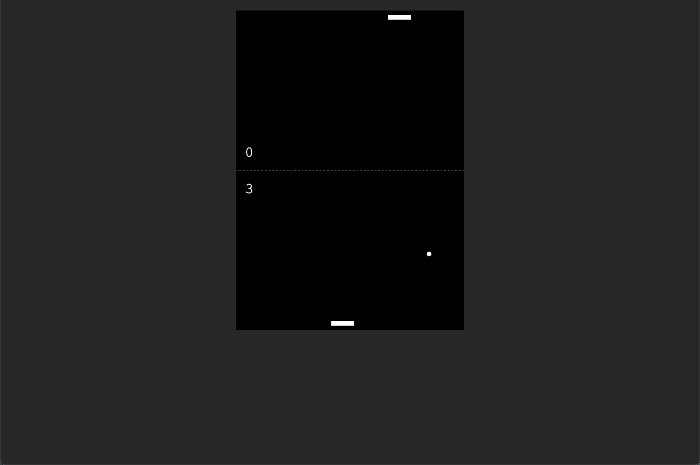

# Pong

## URL

https://vasildimov98.github.io/20.pong/

## Description

Pong is a simple and addictive web-based game built using JavaScript, inspired by the classic arcade game Pong. Test your reflexes and compete against the computer in this fast-paced and thrilling game of virtual ping pong.

Gameplay:

The objective of Pong is straightforward: use your paddle to hit the ball and prevent it from reaching the opposite side. The game is played on a dynamic game board, with two paddles positioned on the left and right sides. You control one of the paddles, while the computer controls the other.

As the ball moves across the screen, your goal is to accurately position your paddle to hit the ball back toward the computer's side. Each successful hit earns you points, and the game becomes progressively faster and more challenging as you advance.

The player with the highest score at the end of the game emerges victorious. Will you be able to outsmart the computer and achieve the highest score in this exciting game of Pong?

